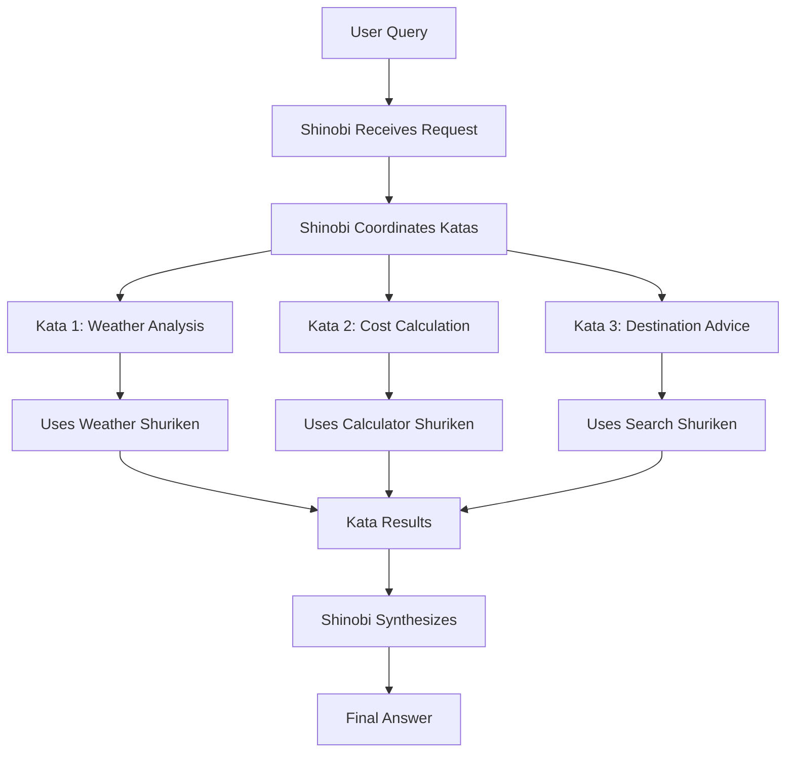

# Core Concepts Overview

The OpenAI Teaching Package is built around a powerful metaphor inspired by Japanese martial arts and ninja traditions. This isn't just creative naming—each concept represents a specific architectural pattern that enables sophisticated AI orchestration.

## 🏗️ The Three Pillars

### 🗡️ Shuriken - The Capabilities
**What**: Individual functions or tools that AI agents can invoke  
**Purpose**: Provide concrete actions like calculations, API calls, data processing  
**Analogy**: Tools in a ninja's arsenal—each designed for a specific purpose

```typescript
const weatherShuriken = new Shuriken(
  'get_weather',           // Function name
  'Get weather data',      // Description  
  weatherSchema,           // Parameter validation
  getWeatherImpl          // Actual implementation
);
```

### 🥋 Kata - The Specialists
**What**: Individual AI agents focused on specific tasks and workflows  
**Purpose**: Handle specialized domains with deep expertise  
**Analogy**: Martial arts forms—practiced, refined techniques for specific situations

```typescript
const weatherAnalyst = new Kata(runtime, {
  model: 'gpt-4o-mini',
  title: 'Weather Analysis Specialist',
  description: 'Analyze weather patterns for travel planning',
  shurikens: [weatherShuriken, calculatorShuriken]
});
```

### 🥷 Shinobi - The Orchestrators  
**What**: Persona-driven coordinators that manage multiple Katas  
**Purpose**: Provide leadership, personality, and high-level coordination  
**Analogy**: Master ninjas who coordinate teams and synthesize results

```typescript
const travelExpert = new Shinobi(runtime, {
  role: 'Expert Travel Assistant',
  description: 'Knowledgeable travel expert',
  backstory: '15+ years of travel industry experience...',
  katas: [weatherAnalyst, costCalculator, destinationAdvisor]
});
```

## 🔄 The Execution Flow

Understanding how these components work together is crucial:



### Step-by-Step Execution

1. **🎯 Request Reception**: Shinobi receives user query
2. **📋 Task Planning**: Shinobi determines which Katas to engage
3. **🥋 Kata Execution**: Each Kata processes the request in their domain
4. **🗡️ Shuriken Invocation**: Katas use shurikens as needed for concrete actions
5. **🔄 Multi-turn Conversations**: Katas can have complex dialogues with the AI
6. **🧠 Synthesis**: Shinobi combines all Kata results into a coherent response
7. **📊 Tracking**: All token usage, costs, and performance metrics are recorded

## 🎭 Persona-Driven Architecture

One of the key innovations is the **persona-driven approach**:

### Shinobi Personas
- **Role**: What they are (e.g., "Travel Expert", "Research Director")
- **Description**: Their core competencies and approach
- **Backstory**: Rich context that influences their responses

### Benefits of Personas
- **Consistency**: Responses align with the character's expertise
- **Quality**: Rich context leads to more nuanced, expert-level responses  
- **Collaboration**: Different personas bring unique perspectives
- **User Experience**: Interactions feel more natural and engaging

## 🔧 Dependency Injection with KataRuntime

The `KataRuntime` provides clean dependency injection:

```typescript
const runtime = new KataRuntime(openai, logger, memory);

// All components get access to:
// - OpenAI client for API calls
// - Logger for structured logging  
// - Memory for persistence and analytics
```

This ensures:
- **Consistent Configuration**: All components use the same OpenAI settings
- **Unified Logging**: Centralized tracking across the entire system
- **Memory Management**: Shared state and persistence layer
- **Testability**: Easy to mock dependencies for testing

## 📊 Built-in Observability

Every component includes comprehensive tracking:

### Token Usage Monitoring
```typescript
{
  prompt_tokens: 1250,
  completion_tokens: 890,
  total_tokens: 2140,
  estimated_cost: 0.001234
}
```

### Execution Metrics
```typescript
{
  execution_time: 2340,  // milliseconds
  shinobi_id: "uuid",
  kata_id: "uuid", 
  shuriken_calls: 3
}
```

### Structured Logging
```typescript
await logger.kataStart('Weather Analysis', userQuery);
await logger.shurikenCall('get_weather', '{"city": "Paris"}');
await logger.kataEnd('Weather Analysis', 'success', 1200);
```

## 🎯 Design Principles

### 1. Separation of Concerns
- **Shurikens**: Handle concrete actions
- **Katas**: Manage specialized workflows  
- **Shinobi**: Provide orchestration and personality

### 2. Composability
- Mix and match shurikens across different katas
- Combine katas into different shinobi configurations
- Reuse components across multiple orchestrations

### 3. Observability First
- Every operation is logged and tracked
- Performance metrics are built-in
- Cost monitoring is automatic

### 4. Type Safety
- Zod schemas ensure parameter validation
- TypeScript provides compile-time safety
- Runtime validation prevents errors

### 5. Testability
- Clean dependency injection
- Mockable components
- Comprehensive test utilities

## 🚀 Scaling Patterns

### Single Shinobi (Simple)
One expert handling a focused domain
```
User → Shinobi → [Kata1, Kata2, Kata3] → Response
```

### Multi-Shinobi (Collaborative)  
Multiple experts providing different perspectives
```
User → Orchestra → [Shinobi1, Shinobi2, Shinobi3] → Synthesis
```

### Hierarchical (Complex)
Nested orchestration for complex workflows
```
User → Master → [Shinobi1 → [Kata...], Shinobi2 → [Kata...]] → Integration
```

## 🎓 Learning Path

Now that you understand the core concepts, dive deeper into each component:

1. **[Shuriken](shuriken)** - Master the art of creating capabilities
2. **[Kata](kata)** - Build specialized AI agents  
3. **[Shinobi](shinobi)** - Design persona-driven orchestrators
4. **[Orchestration](orchestration)** - Coordinate complex workflows
5. **[Memory & Logging](memory-logging)** - Implement persistence and analytics

Each concept builds on the others, creating a powerful and flexible system for AI crew orchestration.